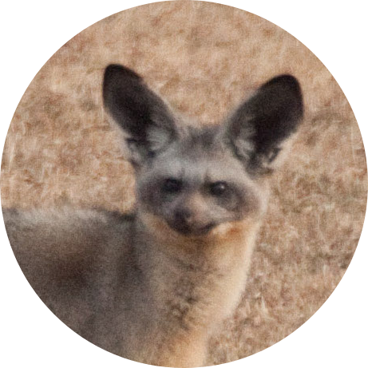

<div id='top-document'/>


<p align="center">

  <h2 align="center">Otocyon</h2>
	<h1 align="center"></h1>
</p>

## :thinking: What is this?

This is the an REST API to get Infos about trophies and achievements in gamer platforms (steam, xbox, playstation).


## :fire: Getting started
Sometimes I leave it on air hosted by Heroku in this endpoint: https://otocyon.herokuapp.com/

But if you want to run local, you can follow next steps:<br>

1. You will need an steam community key. Take yours in [steam website](https://steamcommunity.com/dev/apikey)
2. Clone this repo with `$ git clone https://github.com/matheus2x/otocyon.git`
3. Move yourself to repo with `$ cd otocyon`
4. Run `$ npm install` to install dependencies
5. Create an `.env` file and put yours `STEAM_KEY` (theres a `.env.example` in root to help)
6. Run `$ npm run build` to gen bundle files
7. Run `$ npm run start` to initialize server
<br><br>

## :orange_book: API Usage

* [Steam](#steam)
	* [SteamProfile](#2)
	* [GetPlatinumGameData](#3)
* [Xbox]
	* Comming soon...


<br><br>

<div id='steam' />

# Steam


<div id='2' />


## SteamProfile
**Endpoint:** `{{baseURL}}/steam/profile`

**Method:** GET

**Description:** Pick some infos from your profile in steam

### Query Params
Param|Required|Type|Description
---|---|---|---
steamURL|Yes|String|Steam Profile ID


## Return examples
<details>
<summary>Success</summary>


**Status:** OK - **Code:** 200


```
 {
    "avatarImg": "https://steamcdn-a.akamaihd.net/steamcommunity/public/images/avatars/05/0564fb3e23aaab601433907a8a6d47de6231b883_full.jpg",
    "nickname": "FoxPerks",
    "steamID": "76561198104651572",
    "profileURL": "http://steamcommunity.com/profiles/76561198104651572"
}
```


</details>


[> Back to the top <](#top-document)

<br><br>


<div id='3' />


## GetPlatinumGameData
**Endpoint:** `{{baseURL}}/steam/getPlatinumGameData`

**Method:** GET

**Description:** Platinum confirmed. +300 social credits

### Query Params
Param|Required|Type|Description
---|---|---|---
steamProfileID|Yes|String|Steam Profile ID
steamGameID|Yes|String|Steam Game ID (you need to have all achievements)


## Return examples
<details>
<summary>BadRequest</summary>


**Status:** Bad Request - **Code:** 400


```
 {
    "BadRequest": "\"steamProfileID\" is required"
}
```


</details>


<details>
<summary>Platinum NotFound</summary>


**Status:** Not Found - **Code:** 404


```
 {
    "NotFound": "Player with ID \"76561198104651572\" doesn't have 100% of \"Marvel's Guardians of the Galaxy\""
}
```


</details>


<details>
<summary>Success</summary>


**Status:** OK - **Code:** 200


```
 {
    "platinumGameData": {
        "playerID": "76561198104651572",
        "gameID": "851850",
        "gameName": "DRAGON BALL Z: KAKAROT",
        "gameThumb": "https://steamcdn-a.akamaihd.net/steam/apps/851850/capsule_616x353.jpg",
        "achievsLength": 42,
        "totalTimePlayed": "62.45",
        "lastFiveAchievs": [
            {
                "name": "NEW_ACHIEVEMENT_1_0",
                "unlockTime": 1628473956,
                "icon": "https://steamcdn-a.akamaihd.net/steamcommunity/public/images/apps/851850/1bdbd3d7d5ffea5a9ac84a61b51f77458809dfdc.jpg"
            },
            {
                "name": "NEW_ACHIEVEMENT_1_40",
                "unlockTime": 1628473503,
                "icon": "https://steamcdn-a.akamaihd.net/steamcommunity/public/images/apps/851850/3f6310d607458acc3d041599659c4f54cc3fb0f6.jpg"
            },
            {
                "name": "NEW_ACHIEVEMENT_1_22",
                "unlockTime": 1628473307,
                "icon": "https://steamcdn-a.akamaihd.net/steamcommunity/public/images/apps/851850/a8f3294b17400715de34f09177d6ebf27101476c.jpg"
            },
            {
                "name": "NEW_ACHIEVEMENT_1_32",
                "unlockTime": 1628473060,
                "icon": "https://steamcdn-a.akamaihd.net/steamcommunity/public/images/apps/851850/16ccee04c64aa757c557407603a84dea1deee187.jpg"
            },
            {
                "name": "NEW_ACHIEVEMENT_1_16",
                "unlockTime": 1628456331,
                "icon": "https://steamcdn-a.akamaihd.net/steamcommunity/public/images/apps/851850/2b20caac700356c882f6c726d550e1ea1020810a.jpg"
            }
        ]
    }
}
```


</details>


[> Back to the top <](#top-document)

<br><br>

---

<h4 align="center">
    Made with :fox_face: by <a href="https://www.linkedin.com/in/matheus2x/" target="_blank">Matheus Henrique</a>
</h4>
